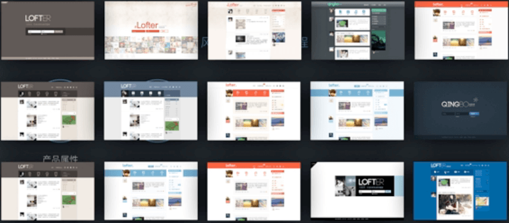
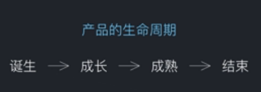
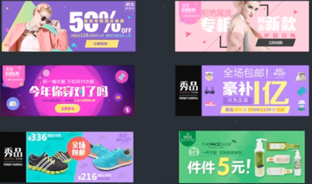
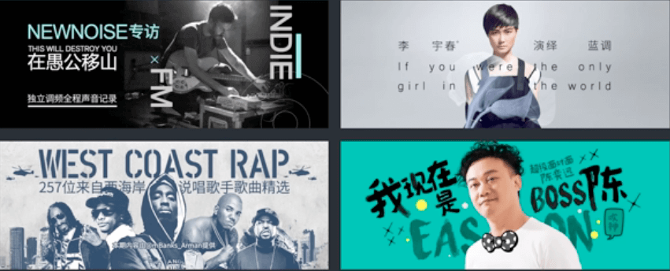
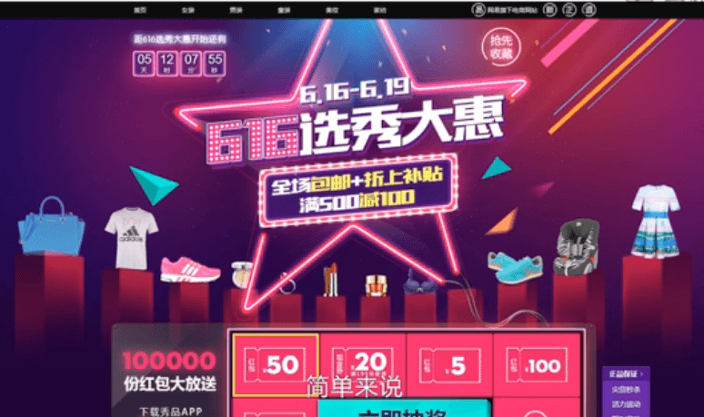

<!-- START doctoc generated TOC please keep comment here to allow auto update -->
<!-- DON'T EDIT THIS SECTION, INSTEAD RE-RUN doctoc TO UPDATE -->
**Table of Contents**  *generated with [DocToc](https://github.com/thlorenz/doctoc)*

- [UI设计的日常工作](#ui%E8%AE%BE%E8%AE%A1%E7%9A%84%E6%97%A5%E5%B8%B8%E5%B7%A5%E4%BD%9C)
  - [风格定位](#%E9%A3%8E%E6%A0%BC%E5%AE%9A%E4%BD%8D)
    - [分析](#%E5%88%86%E6%9E%90)
    - [创作](#%E5%88%9B%E4%BD%9C)
    - [筛选](#%E7%AD%9B%E9%80%89)
    - [规范](#%E8%A7%84%E8%8C%83)
    - [制作](#%E5%88%B6%E4%BD%9C)
  - [产品迭代](#%E4%BA%A7%E5%93%81%E8%BF%AD%E4%BB%A3)
  - [BANNER](#banner)
  - [专题活动](#%E4%B8%93%E9%A2%98%E6%B4%BB%E5%8A%A8)

<!-- END doctoc generated TOC please keep comment here to allow auto update -->

# UI设计的日常工作

UI设计一般会包括以下四个方面的工作：**风格定位、产品迭代、BANNER、专题活动。**根据业务内容的不同，UI设计师还可以细分为：**UI设计师和推广设计师**。

- **UI设计师，主要做风格定位和产品迭代的工作。**它需要有扎实界面、ICON、交互设计、品牌设计以及产品意识。
- **推广设计师，主要做BANNER和主体活动的工作。**它比较讲究表现的美感，要求对版式以及配色有创造力，有字体和插图的创作能力，对市场营销有一定的了解。

## 风格定位

**风格定位的核心**

分析用户的喜好，得出用户对产品的期望，最后设计出符合用户期望的产品。

**风格定位的两个关键点**

- 抓准方向。需要洞悉产品的本质，推导出埋藏在用户内心里最根本的愿望。如果想要有更大的突破，则需要在生活中多体验多思考才能有更大的进步。
- 极致技术。抓住你方向之后，就要用技术做出来，而提升自己技术就需要在平时多多观摩优秀的作品。

一般风格定位可以按照：**分析->创作->筛选->规范->制作**来做。

### 分析

分析产品属性（工具性、娱乐性、大大众型等）、目标用户、竞争产品，最后得出产品的关键词，如：个性、简洁等。

### 创作

根据分析后得出的关键词进行头脑风暴，创作出多个设计稿。例如下图就是LOFTER设计时的创作稿。

### 筛选

有条件做一下用户调研，从“创作”阶段中的方案选出一个最好的

### 规范

前面三步确定产品风格之后，在这一步需要制作一套视觉规范，用于约束后面的设计不要受到干扰。规范基本上包括：**色彩规范、图标规范、按钮规范、排版规范**。

### 制作

制作指的是具体页面的制作

下面我们可以看一下几个经典产品的风格定位思考：

**LOFTER**

- 目标用户：摄影师、画家
- 目标：吸引摄影师和画家发表图片
- 用户期望：希望自己的作品像放在博物馆一样放在LOFTER上
- 设计细节：大胆的几何图形、边界分明、多样化的版式设计

**网易云音乐**

- 用户行为：欣赏音乐
- 风格定位：很专业、很有品质感
- 具体场景：录音房
- 场景常见的元素：黑色金属、吸引材料、黑胶唱片等
- 色系：基色为黑色，使其沉稳结实，又用代表激情的红色来做点缀。
- 具体配色：背景为磨砂黑色金属

## 产品迭代

在产品的生命周期里，是需要不断进行产品迭代的，而在产品迭代过程中必定会涉及到界面的修改，这时候就需要UI设计师根据交互设计师的交互设计稿来设计具体的界面。

## BANNER

BANNER一般是用来宣传一个活动的图片。真正好的BANNER必须符合广告本身的意图。因此**一个好的设计应该在了解传播意图的基础上，做出合适的设计**，而不是只考虑自己的喜好。

**电商类banner**

**lofter banner**

**music banner**

可以看出不同类型的BANNER，其风格也不一样，这就需要设计师根据不同业务场景涉及不同风格的BANNER。BANNER设计一般都很简单，都是一个主题，一个标题。因此**对于banner来说，配色和字体设计更为重要**。

## 专题活动

专题活动通常是指为了拉新、提高用户活跃度而做的一次专题活动，例如淘宝双十一活动、京东618活动等等。

