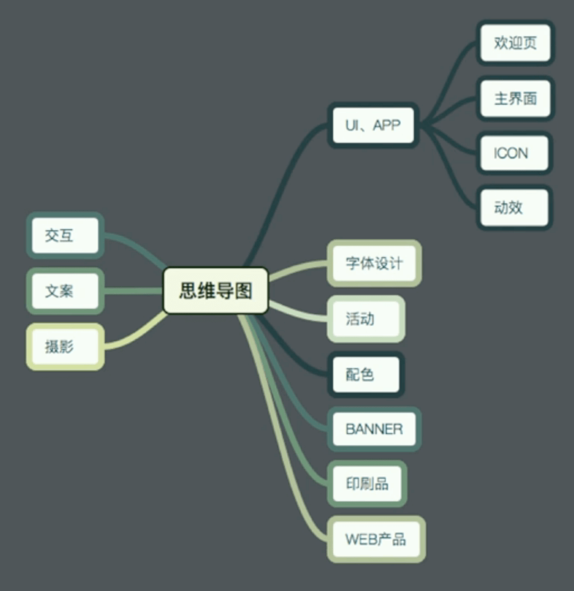
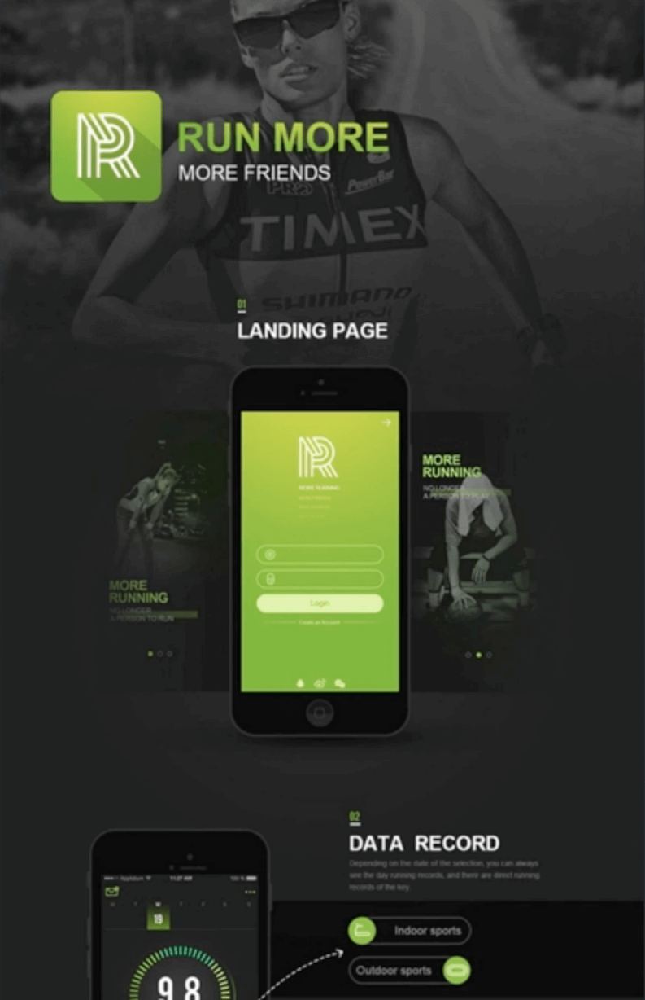
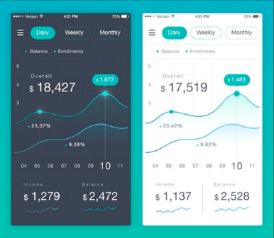
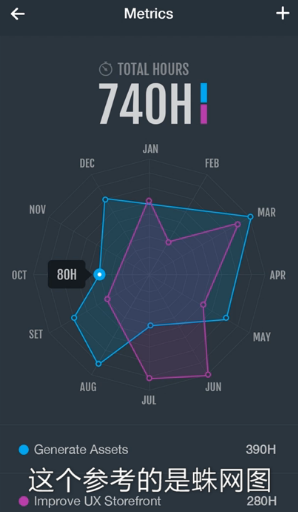
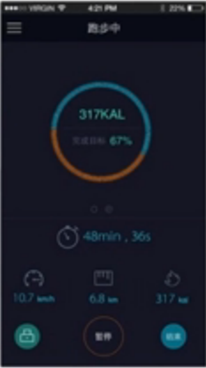
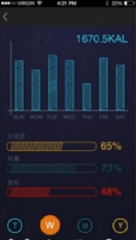
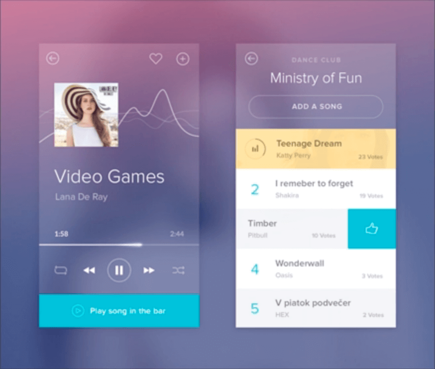
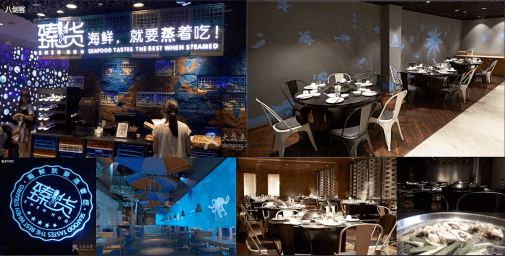
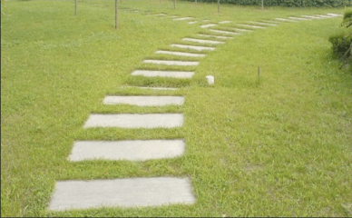

<!-- START doctoc generated TOC please keep comment here to allow auto update -->
<!-- DON'T EDIT THIS SECTION, INSTEAD RE-RUN doctoc TO UPDATE -->
**Table of Contents**  *generated with [DocToc](https://github.com/thlorenz/doctoc)*

- [UI设计的必备习惯](#ui%E8%AE%BE%E8%AE%A1%E7%9A%84%E5%BF%85%E5%A4%87%E4%B9%A0%E6%83%AF)
  - [储备素材](#%E5%82%A8%E5%A4%87%E7%B4%A0%E6%9D%90)
  - [设计思考](#%E8%AE%BE%E8%AE%A1%E6%80%9D%E8%80%83)
  - [了解行业](#%E4%BA%86%E8%A7%A3%E8%A1%8C%E4%B8%9A)

<!-- END doctoc generated TOC please keep comment here to allow auto update -->

# UI设计的必备习惯

一些好的习惯可以帮助你在UI设计的道路上走得更好、更远。在UI设计中，**储备素材、设计思考、了解行业**这三个习惯可以让你做得更好，储备素材能让你在设计作品的时候有丰富的素材库。而设计思考能让你深入理解设计的本质，从而做出更好的设计。

## 储备素材

当要设计一个东西的时候，最好的方法是找一个接近的素材作为基础，在它的基础上进行修改，这样就可以快速设计出需要的东西。

收藏素材的来源一般有：

- 专业网站：花瓣、Dribble、站酷等等
- 专业相关：书籍、艺术展
- 生活：马路上、豆瓣、看新闻

**收藏的原则：收藏的设计至少要有一个学习点。**不同设计师对学习点会有不同的细分，可以参考这个：

**收藏样例1**

在黑色基调下配上绿色，感觉很刺激。以后如果想要做一些刺激一点的设计，就可以参考。

**收藏样例2**

通栏的曲线很酷，没有拘束，而且曲线上的一些提示点也很有意思。在圆点加了发光。

**收藏样例3**

参考蛛网图的设计，以及整理配色和排版

**收藏样例4**

参考图表设计的创意

**收藏样例5**

参考透明背景的效果

**收藏样例6**

参考整体配色以及中间图片的排版方式

## 设计思考

当遇到一些印象很深刻的设计时，要去思考是什么东西让你有这么什么的印象或营造出了这种氛围，从而一点点思考这样设计的原因。

比如一进入上面这间店就会给人一种潜入到了海底的感觉，那到底是什么元素让你产生这种感觉呢？这是作为一个设计师需要深入去思考的。

作为设计师，**在生活中要多注意感受美和丑，不要只是感觉完就算了，要去思考背后的原理**，这就是设计的敏感度。

在买票的时候刷身份证的地方都是斜的，这么做的原因是为了不让你把身份证落下而设计的，虽然会损失一些便捷性，但这样还是值得的。

通过设计让中间的踏板和草地不一样，让人有一种想去踩的冲动，由此来保护草地。

## 了解行业

了解互联网行业的动态，你需要关注两方面：

- **关注设计行业。**它能让你学到更多专业知识，提升自己的技能，做出更棒的效果。
- **关注互联网行业。**它能帮助你开拓视野，让你从更高层面来指导设计。

