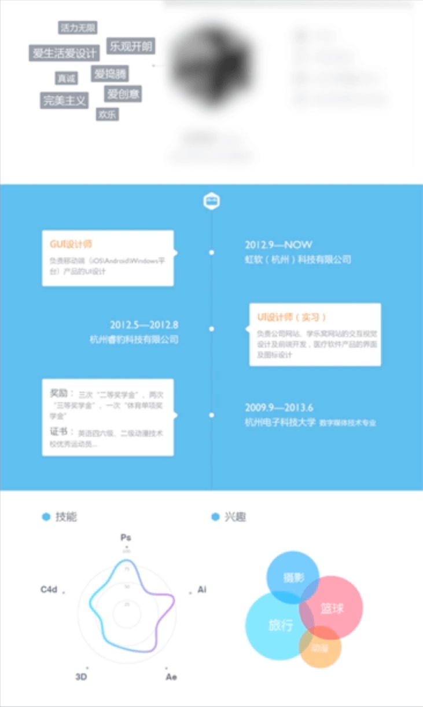
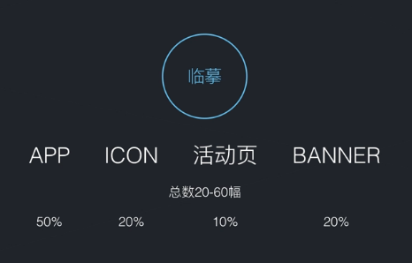

<!-- START doctoc generated TOC please keep comment here to allow auto update -->
<!-- DON'T EDIT THIS SECTION, INSTEAD RE-RUN doctoc TO UPDATE -->
**Table of Contents**  *generated with [DocToc](https://github.com/thlorenz/doctoc)*

- [准备面试材料](#%E5%87%86%E5%A4%87%E9%9D%A2%E8%AF%95%E6%9D%90%E6%96%99)
  - [个人简历](#%E4%B8%AA%E4%BA%BA%E7%AE%80%E5%8E%86)
  - [作品](#%E4%BD%9C%E5%93%81)

<!-- END doctoc generated TOC please keep comment here to allow auto update -->

# 准备面试材料

面试材料主要有**个人简历、设计作品**两大部分。

## 个人简历

两个重要点：**教育背景、工作经历。**

如果自己对版式设计掌握得比较好可以设计一下，就像下面的简历一样，设计得好可以加分。

但是如果不熟悉版面设计，那还是老老实实用Word文档就可以了，不然可能还会给人留下不好的印象。

## 作品

UI设计一般发送简历的时候都会附上个人作品，这时候注意以下细节可以做得更好。

- 按照业务类型把作品按文件夹分类好，比如：banner、ICON、UI、字体等。
- 如果有需要，要把临摹的和自己设计的按文件夹分开存放。
- 作品最好能够表现出自己的各种能力，如：排版能力、配色能力等。
- 作品不求多，但求精华

如何从现在就开始准备作品呢？主要还是从**业务范围、技能广度、设计品味、细节把握**上来提高，后面两项是需要在实际生活中去提高的，而前面两项则可以从现在做起。

**如何开始？**

从临摹开始，可以临摹`APP/ICON/活动页/BANNER`这些类型的图，从而提高自己的业务范围技能。数量最好20-60幅，质量要好。`APP/ICON/活动页/BANNER`的比例大约在：50%、20%、10%、20%，主要还是以UI为主。

如果有自己的原创作品那就更好了，但是要**注意一定只放最好的作品。如果原创的效果太差，那还不如不要。**