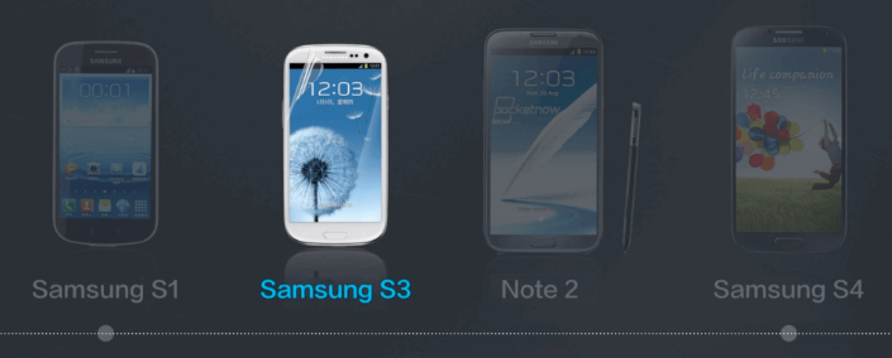
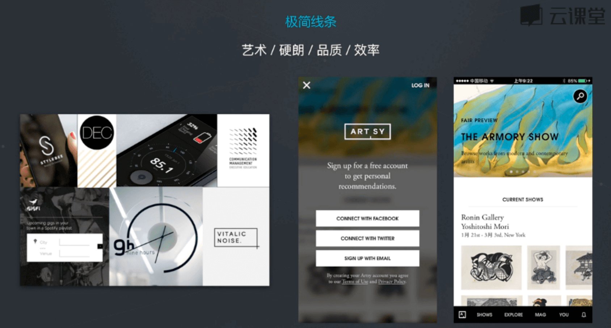
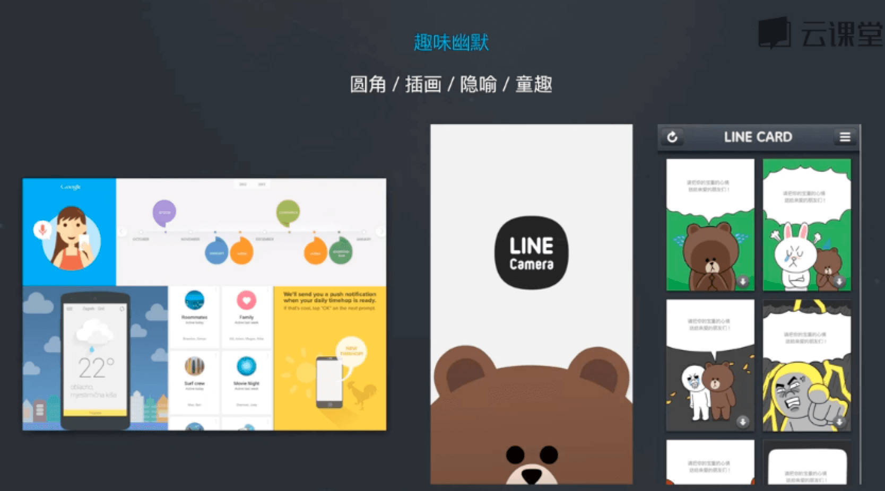
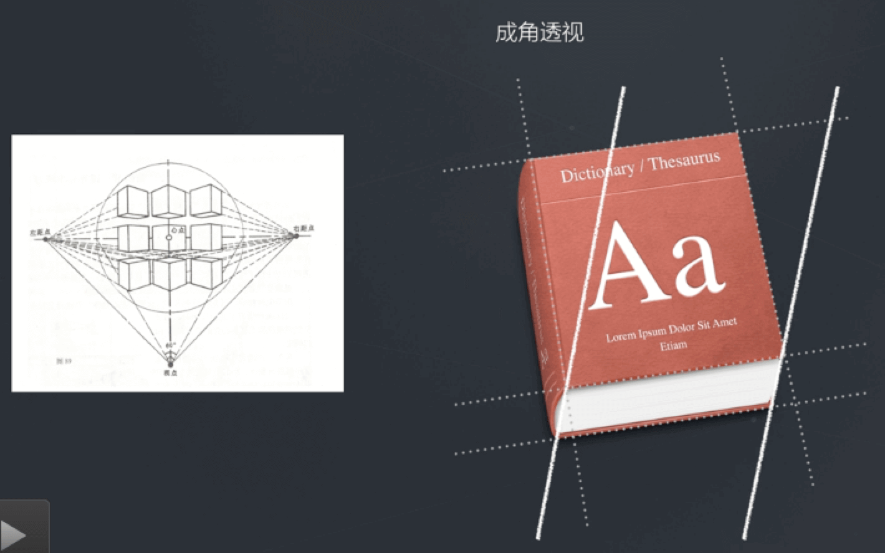

# icon基本规律和基本技法

界面是点线面组成的，面是色彩，线是排版，而点就是ICON。

## ICON发展历程

- 1981年，Serox Star
- 1983年，Apple Lisa
- 1985年，Windows1.0
- 1985年，Amiga Workbench
- 1990年，Windows3.0
- 1995年，Windows95
- 1997年，MAC OS 8
- 2001年，MAC OS X
- 2001年，Windows XP
- 2006年，Windows Vista
- 2008年，MAC OS X Snow Leopard

总结：人们追求的设计发生了什么变化？

能用就行 -> 看懂就行 -> 好用好看 -> 效率为王

## 无线端设计发展趋势

### iOS系统发展趋势

- 2007年，iPhone1
- 2009年，iPhone3Gs
- iOS5/iOS6 —— iPhone4(s)
- iOS7 —— iPhone5s
- iOS8/9 —— iPhone6s/Plus

总结：

- 行业领袖，乐于挑战和自我突破
- 极简的扁平化，形式追随功能，视觉服务内容
- 激进的革新派
- 用于挑战现有审美
- 扁平化在多平台上又良好的适应性
- 引导而不是迎合消费者
- 有领袖型的创新风格

### Android系统

- Android早期 —— Nexus1
- Android4 —— Nexus4，开始用传统拖放的功能
- Android4.4 —— Nexus5，以扁平和大色块为主
- Android5.0 

总结：

- 大面积使用色彩，活跃

### 三星

- 三星 S1 —— TouchWiz早期
- 三星 S3
- Note 2
- Samsung S4
- Note Edge

总结：

- 从缓慢中庸，到有攻击性的创新
- 从刻板保守，到情感化与创新性
- 简约扁平的图标与更明快的色彩
- 进一步的操作与硬件革新

### MeiZu Flyme

- M8 —— 早期深度定制
- MX —— Flyme1.0
- MX2 —— Flyme2.0
- MX4 —— Flyme4.0，采用全新字体

总结：

- 明确地品牌特性
- 在扁平化趋势的影响下也走向简约，但仍然保持自己的路线
- 使用更明快的大面积色块与最简练的层次来提现扁平趋势
- 更为活泼积极的娱乐感受

**总结：色彩越来越鲜艳，形体视觉越来越简洁。**

## 情感化模块

### 有机圆润

### 锐利几何

### 舒适色彩 

### 自信色彩

### 轻材质

### 极简线条

### 趣味幽默

## 透视

### 平行透视

### 成角透视

## 造型

先手绘， 手绘之后再上手PS去画，这样效果更好，效率更高。

