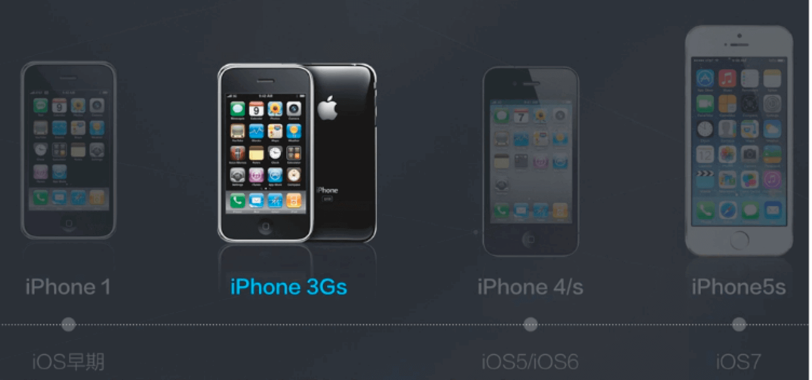
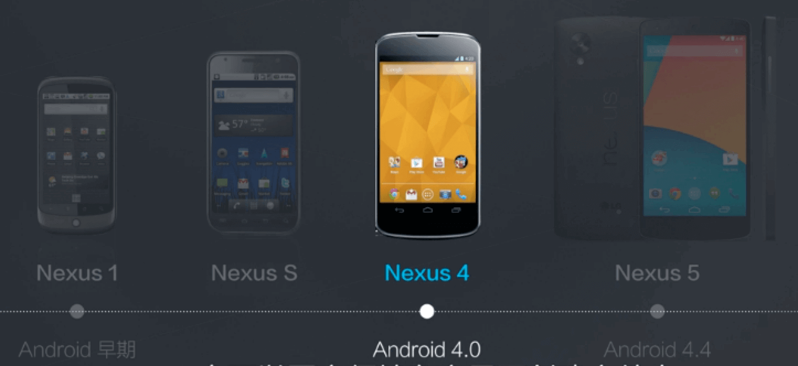
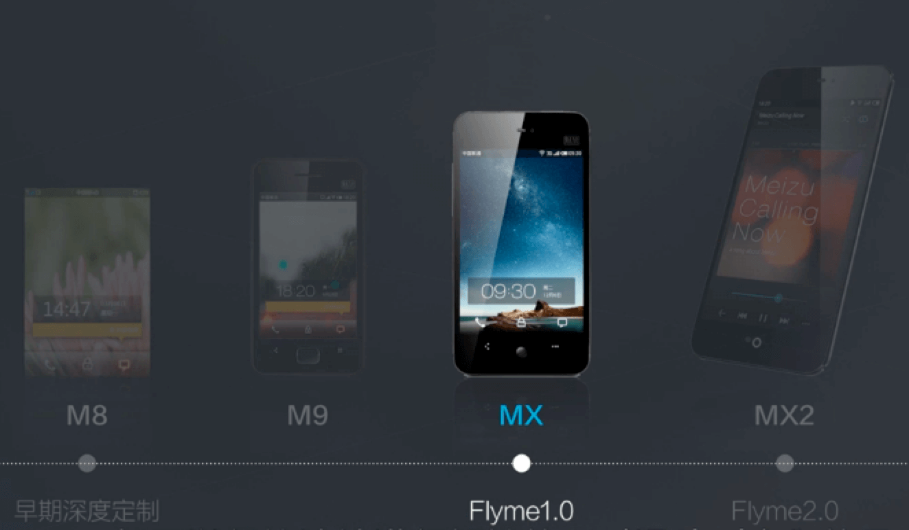
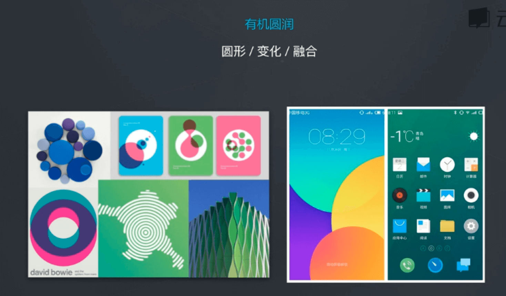
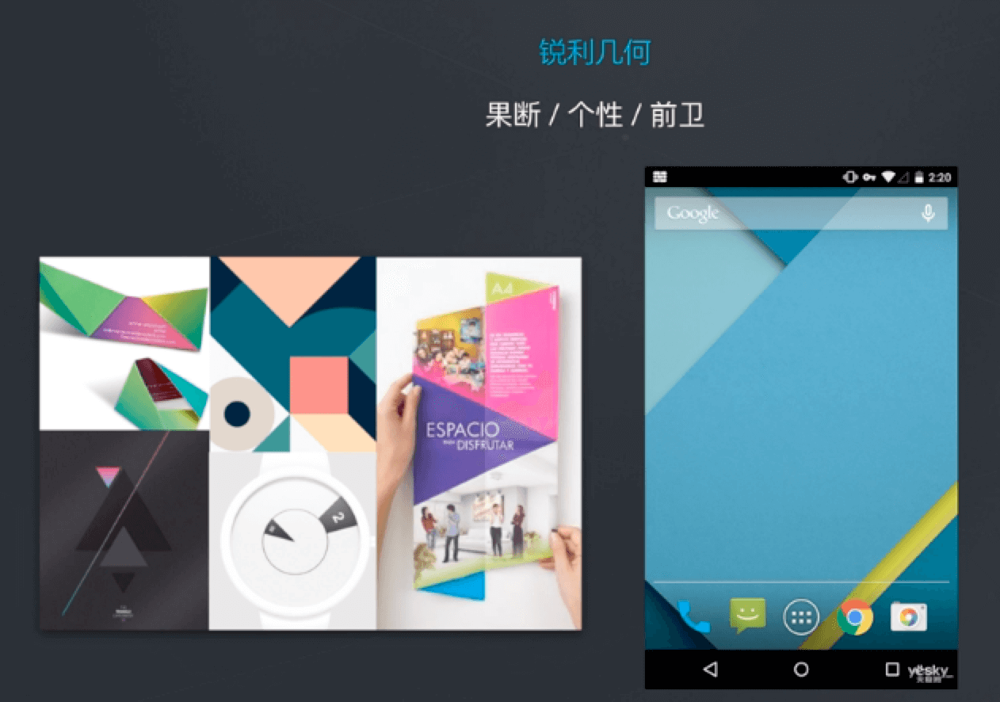
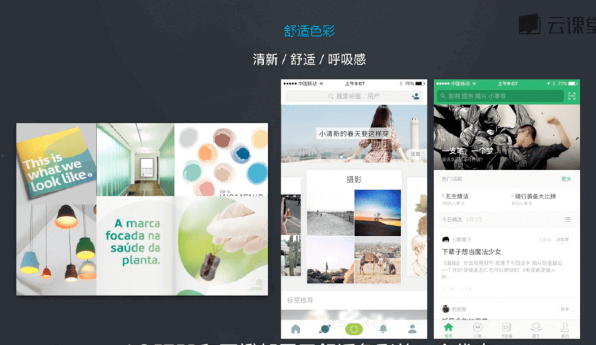
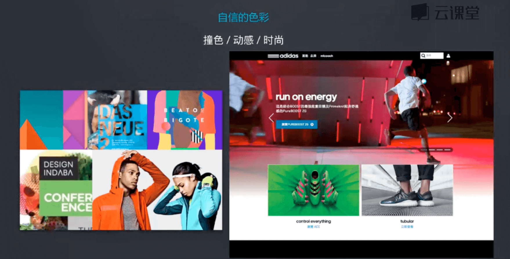
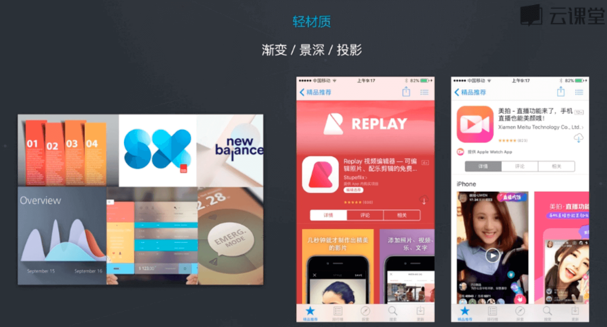
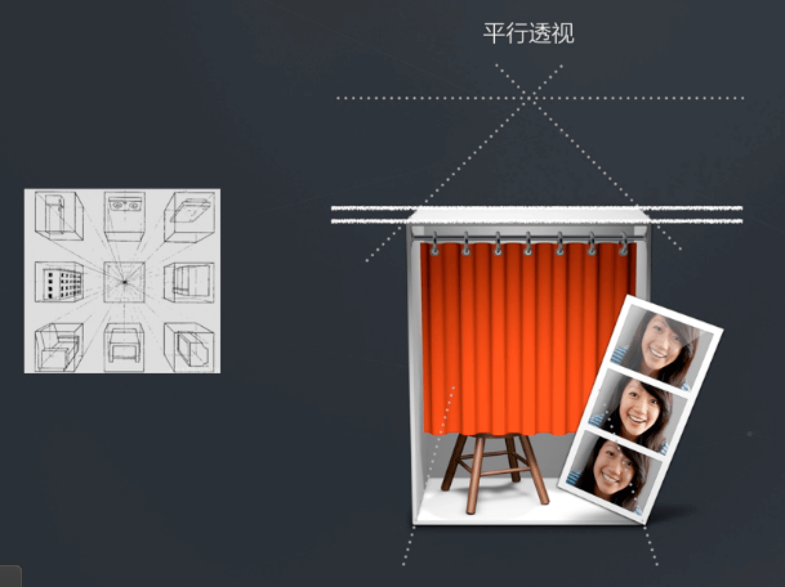
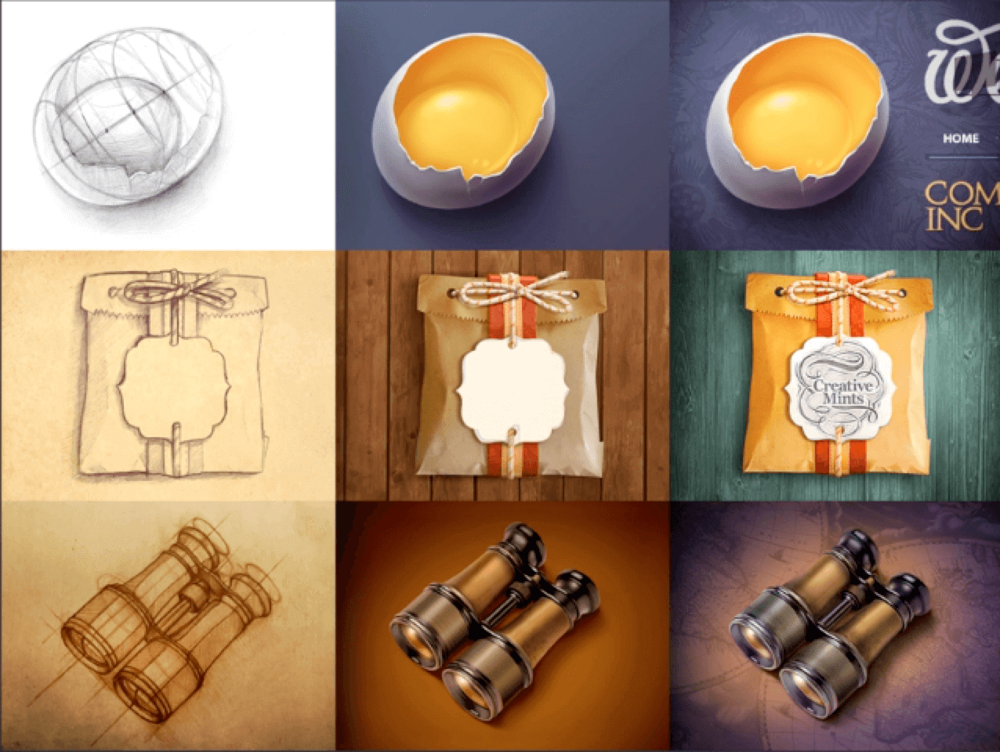

<!-- START doctoc generated TOC please keep comment here to allow auto update -->
<!-- DON'T EDIT THIS SECTION, INSTEAD RE-RUN doctoc TO UPDATE -->
**Table of Contents**  *generated with [DocToc](https://github.com/thlorenz/doctoc)*

- [icon基本规律和基本技法](#icon%E5%9F%BA%E6%9C%AC%E8%A7%84%E5%BE%8B%E5%92%8C%E5%9F%BA%E6%9C%AC%E6%8A%80%E6%B3%95)
  - [ICON发展历程](#icon%E5%8F%91%E5%B1%95%E5%8E%86%E7%A8%8B)
  - [无线端设计发展趋势](#%E6%97%A0%E7%BA%BF%E7%AB%AF%E8%AE%BE%E8%AE%A1%E5%8F%91%E5%B1%95%E8%B6%8B%E5%8A%BF)
    - [iOS系统发展趋势](#ios%E7%B3%BB%E7%BB%9F%E5%8F%91%E5%B1%95%E8%B6%8B%E5%8A%BF)
    - [Android系统](#android%E7%B3%BB%E7%BB%9F)
    - [三星](#%E4%B8%89%E6%98%9F)
    - [MeiZu Flyme](#meizu-flyme)
  - [情感化模块](#%E6%83%85%E6%84%9F%E5%8C%96%E6%A8%A1%E5%9D%97)
    - [有机圆润](#%E6%9C%89%E6%9C%BA%E5%9C%86%E6%B6%A6)
    - [锐利几何](#%E9%94%90%E5%88%A9%E5%87%A0%E4%BD%95)
    - [舒适色彩](#%E8%88%92%E9%80%82%E8%89%B2%E5%BD%A9)
    - [自信色彩](#%E8%87%AA%E4%BF%A1%E8%89%B2%E5%BD%A9)
    - [轻材质](#%E8%BD%BB%E6%9D%90%E8%B4%A8)
    - [极简线条](#%E6%9E%81%E7%AE%80%E7%BA%BF%E6%9D%A1)
    - [趣味幽默](#%E8%B6%A3%E5%91%B3%E5%B9%BD%E9%BB%98)
  - [透视](#%E9%80%8F%E8%A7%86)
    - [平行透视](#%E5%B9%B3%E8%A1%8C%E9%80%8F%E8%A7%86)
    - [成角透视](#%E6%88%90%E8%A7%92%E9%80%8F%E8%A7%86)
  - [造型](#%E9%80%A0%E5%9E%8B)

<!-- END doctoc generated TOC please keep comment here to allow auto update -->

# icon基本规律和基本技法

界面是点线面组成的，面是色彩，线是排版，而点就是ICON。

## ICON发展历程

- 1981年，Serox Star
- 1983年，Apple Lisa
- 1985年，Windows1.0
- 1985年，Amiga Workbench
- 1990年，Windows3.0
- 1995年，Windows95
- 1997年，MAC OS 8
- 2001年，MAC OS X
- 2001年，Windows XP
- 2006年，Windows Vista
- 2008年，MAC OS X Snow Leopard

总结：人们追求的设计发生了什么变化？

能用就行 -> 看懂就行 -> 好用好看 -> 效率为王

## 无线端设计发展趋势

### iOS系统发展趋势

- 2007年，iPhone1
- 2009年，iPhone3Gs
- iOS5/iOS6 —— iPhone4(s)
- iOS7 —— iPhone5s
- iOS8/9 —— iPhone6s/Plus

总结：

- 行业领袖，乐于挑战和自我突破
- 极简的扁平化，形式追随功能，视觉服务内容
- 激进的革新派
- 用于挑战现有审美
- 扁平化在多平台上又良好的适应性
- 引导而不是迎合消费者
- 有领袖型的创新风格

### Android系统

- Android早期 —— Nexus1
- Android4 —— Nexus4，开始用传统拖放的功能
- Android4.4 —— Nexus5，以扁平和大色块为主
- Android5.0 

总结：

- 大面积使用色彩，活跃

### 三星

- 三星 S1 —— TouchWiz早期
- 三星 S3
- Note 2
- Samsung S4
- Note Edge

总结：

- 从缓慢中庸，到有攻击性的创新
- 从刻板保守，到情感化与创新性
- 简约扁平的图标与更明快的色彩
- 进一步的操作与硬件革新

### MeiZu Flyme

- M8 —— 早期深度定制
- MX —— Flyme1.0
- MX2 —— Flyme2.0
- MX4 —— Flyme4.0，采用全新字体

总结：

- 明确地品牌特性
- 在扁平化趋势的影响下也走向简约，但仍然保持自己的路线
- 使用更明快的大面积色块与最简练的层次来体现扁平趋势
- 更为活泼积极的娱乐感受

**总结：色彩越来越鲜艳，形体视觉越来越简洁。**

## 情感化模块

### 有机圆润

### 锐利几何

### 舒适色彩 

### 自信色彩

### 轻材质

### 极简线条

### 趣味幽默

## 透视

### 平行透视

### 成角透视

## 造型

先手绘， 手绘之后再上手PS去画，这样效果更好，效率更高。

