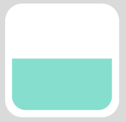

<!-- START doctoc generated TOC please keep comment here to allow auto update -->
<!-- DON'T EDIT THIS SECTION, INSTEAD RE-RUN doctoc TO UPDATE -->
**Table of Contents**  *generated with [DocToc](https://github.com/thlorenz/doctoc)*

- [扁平化icon实际演示](#%E6%89%81%E5%B9%B3%E5%8C%96icon%E5%AE%9E%E9%99%85%E6%BC%94%E7%A4%BA)

<!-- END doctoc generated TOC please keep comment here to allow auto update -->

# 扁平化icon实际演示

首先先剖析ICON的整体结构，可以看到ICON由底座和镜头组成

之后用圆角矩形工具画个底座

之后画对应的镜头部分

相机的基本形状出来了，但是缺少了一些细节，比如：高光。下面我们给镜头加上一些高光。

现在看起来是不是更好了呢。这里其实还有许多的细节需要处理，有时间的时候多做几次，就能注意到平时没注意到的细节。

**总结：对于CION来说，颜色以及形体的归纳才是最重要的，而细节不是特别重要的。**

## 原创、再设计、临摹

### 概念

- 原创：内容不是抄袭别人的，而是根据自己对于现实实物的观察，提炼加工而进行创作的过程。
- 再设计：重新审视已经存在的产品，在提升产品体验、美感等前提下，来改进其原先的设计的过程。
- 临摹：按照其他人的作品，模仿其效果、配色和交互的过程叫做临摹。

### 区分

根据照片、实物提炼总结而设计出来的作品，即使和实物很像，那也不叫临摹，而叫原创，只是扁平化、半写实、拟物化和超写实的区别。而如果在设计过程中，是根据别人的作品进行参考，并且借鉴元素和做法超过40%以上的，那都叫做临摹。再设计是在原作的基础上，从产品体验、配色、交互等层面解决用户的痛点，从而让用户的使用和理解更加流畅的过程，就叫做再设计，如给一些网站做再设计，可能这个网站交互体验很好，但是呈现方式有问题，你觉得美感不足，那你可以在不改变其交互方式的基础上去做再设计。

### 联系

再设计和临摹的基础都是先有原创，所以原创是很重要的过程。再设计就像一种传承的过程，取其精华，去其糟粕；再设计可以看到原创的影子，但是又感觉提升了一个档次。如果再设计比原创还差，那就叫做山寨。如果完全根据原创的作品来进行的设计，没有自己任何的想法，只是单纯地重现原创者的型，那就是临摹。当然，临摹也有一定的好处，能够让你熟悉工具的用法，了解不同的效果的做法以及提高审美、配色和细节的把控能力。想要再设计和原创，都要通过先临摹优秀的作品，达到一定量的积累，才可以做出好的作品，不然创新不足，基础不牢，只会做出粗糙而可用性差的产品。