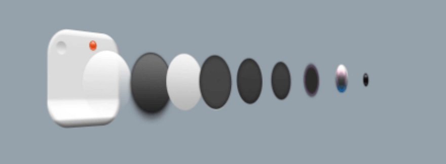
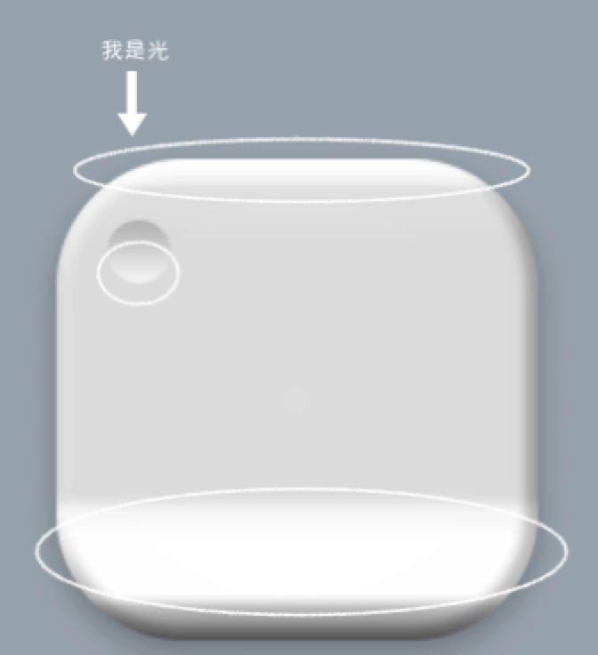
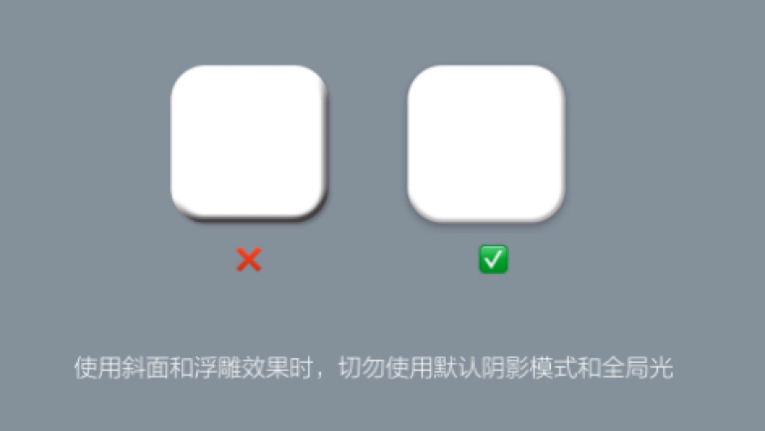

<!-- START doctoc generated TOC please keep comment here to allow auto update -->
<!-- DON'T EDIT THIS SECTION, INSTEAD RE-RUN doctoc TO UPDATE -->
**Table of Contents**  *generated with [DocToc](https://github.com/thlorenz/doctoc)*

- [半写实状态icon](#%E5%8D%8A%E5%86%99%E5%AE%9E%E7%8A%B6%E6%80%81icon)
  - [小贴士](#%E5%B0%8F%E8%B4%B4%E5%A3%AB)

<!-- END doctoc generated TOC please keep comment here to allow auto update -->

# 半写实状态icon

一个ICON我们首先要分析它的结构，我们可以看到它是由底座，以及多个镜头层组成。

画底座的时候，要分析哪里是高光，各部位的高光哪里最亮哪里最暗

之后画各部位的镜头，画镜头的时候要注意多个层重叠才能表现出镜头的光晕感。

## 小贴士

