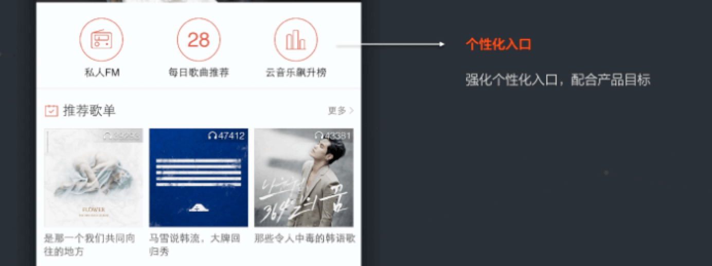
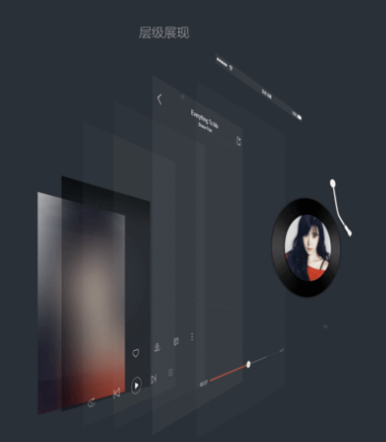
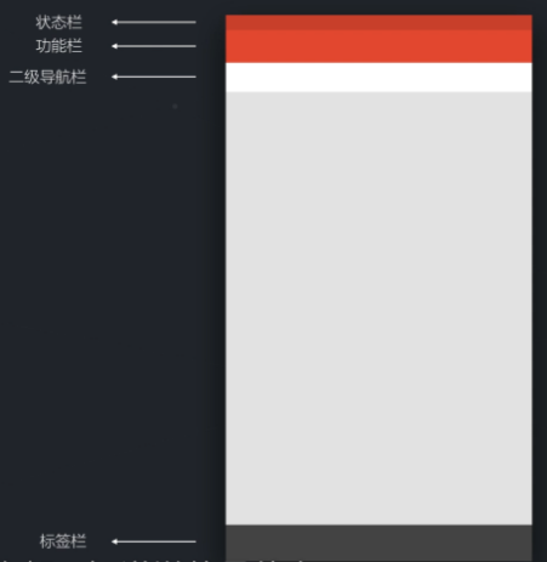
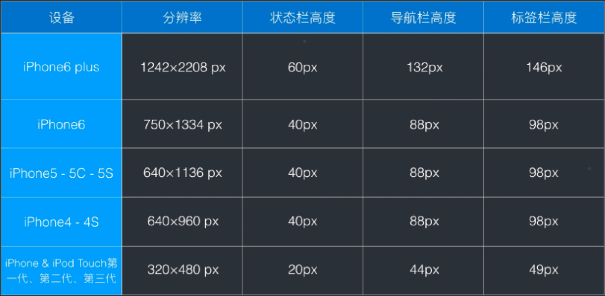
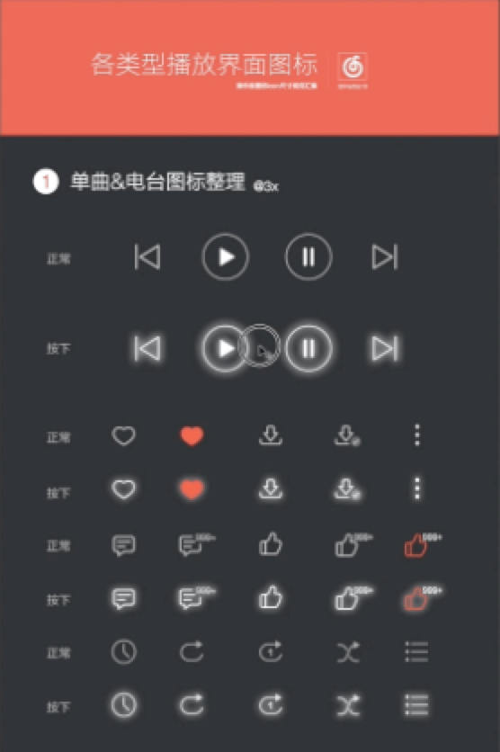
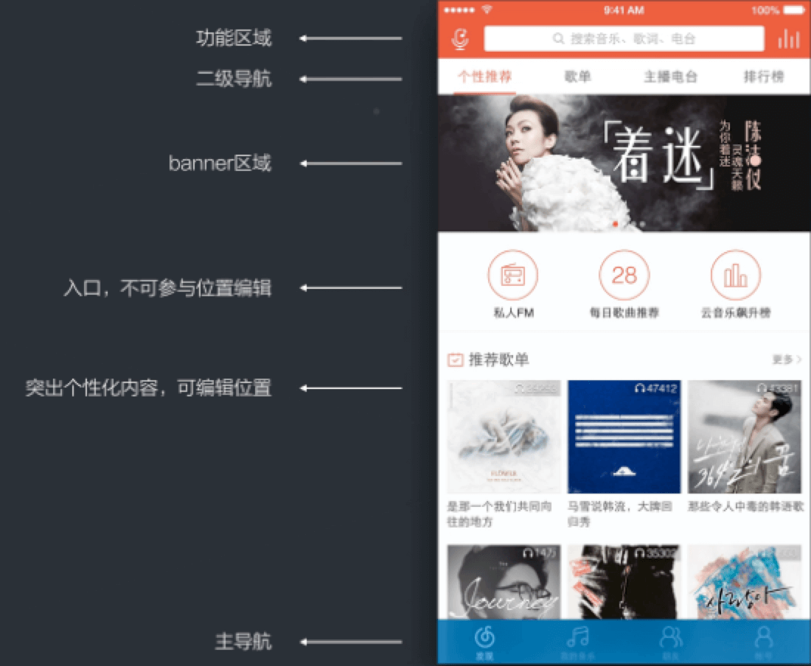
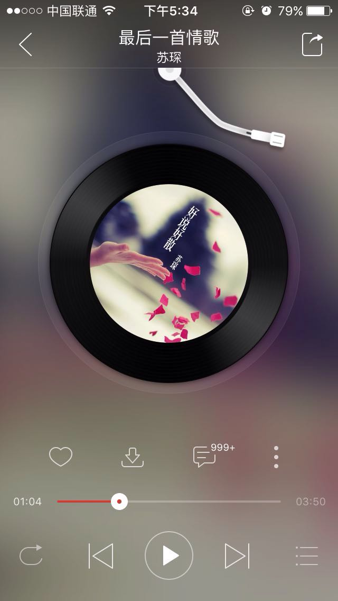

# 无线端APP设计演示

我们将以**网易云音乐**为例子来讲解无线端APP的设计。

## 视觉设计师如何看待交互稿？ 

在视觉设计师看来，交互稿一般有以下三个作业：

- 设计目的
- 页面结构
- 层级表现

### 设计目的

**交互设计稿能够体现设计目的，这里的设计目的又可以分为产品目的和功能目的。**

- 产品目的：区别于竞品，突出差异化；强调个性化推荐；推荐歌单，独家放送，推荐MV；产品目的是站在产品经理的角度进行的思考。
- 功能目的：加入个性化推荐目的；简化推荐层级结构；功能目的是站在交互设计师的角度进行的思考

### 页面结构

**交互设计稿可以先页面的结构**，以云音乐来说其页面结构可以划分为：搜索音乐和听音识歌、快速播放等。

- 搜索音乐和听音识歌功能

强化搜索功能，把1.0时的搜索按钮以及隐藏的听音识歌个能放出

- 快速播放

全局设计，无论当前处于哪个界面，都可以快速播放音乐

- banner

展示推广位和商业化设计，不具备功能性

- 个性化入口

强化个性化入口，配合产品目标

- 推荐歌单

挖掘用户使用习惯于听歌习惯进行个性化推荐

- 个性化推荐

根据用户使用习惯来调整栏目顺序

### 层级展现

**如何表现层级：颜色、明暗、大小、距离、叠压**

播放详情页面的层级展现：黑胶唱片 -> 播放进度 -> 评论喜欢 -> 遮罩 -> 视觉渲染

## 如何根据交互稿进行设计

在根据交互稿进行设计的时候，首先要根据不同设计制定控件规范，之后根据交互稿进行信息分析，最终确定区域排版。在设计的时候，需要考虑以下三个点：

- 控件规范
- 信息分析 

### 控件规范

- 设备规范
- 图标规范

根据不同的手机分辨率，需要做出多套图片，以适应不同设备。以iOS设备来说，现在需要制作3套图，我们一般称为：1X图、2X图、3X图。

 

其中1X图适用于iPhone4以下的机型，状态栏高度为20px；2X图适用于iPhone4到iPhone6的机型，状态栏高度为40px；3X图适用于iPhone6 Plus，状态栏高度为60px。

除了设备规范外，还需要制定图标规范

### 信息分析

## 操作演示

**发现音乐页面**

**音乐详情页面**

TIPS：

- 先把大框架做好再去做细节
- 要形成产品的界面图标规范库

