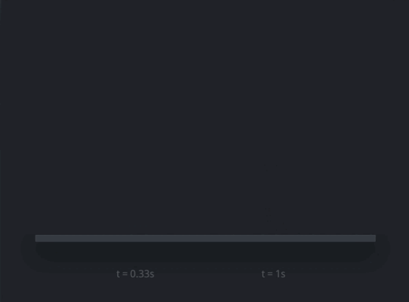
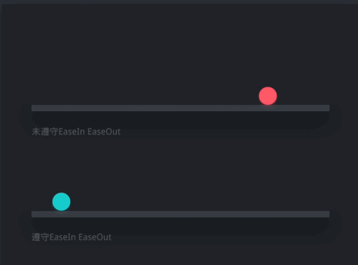
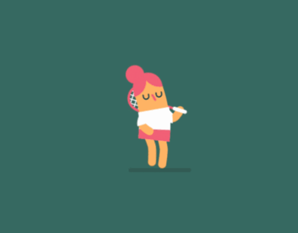
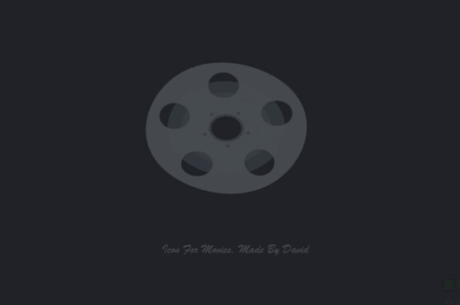

# 动效八要素

- 时间间距（动画节奏）
- 缓入缓出（情感传递模拟现实）
- 预备动作（模拟现实）
- 动作跟随（模拟现实）
- 挤压和拉伸（情感表达）
- 夸张手法（情感表达）
- 二次动作
- 连续打帧和对应打帧

## 时间间距

同一动作，不同的时间间距会给人不同的感觉。

红色球的时间间距较短，落得就快，会给人一种比较重的感觉。而蓝色球的时间间距较长，落得就慢，就会给人一种比较轻的感觉。

不同的速度曲线会给人不同的感觉：

## 缓入缓出

缓入缓出指的是根据物体自身的物理属性，对物体的速度做一个调节，从而达到使其匀速曲线符合物理常识的做法。

红色球始终保持匀速前行，这并不符合我们的常识，因为没有物体能够在不受外力的作用下保持匀速前进。而蓝色球则是先快后慢，符合我们的常识。

## 预备动作

物体运动之前，都会积攒势能，再释放出去。而这个积攒势能的过程就是预备动作，预备动作可以给出物体下一步要干什么。

上图中小女孩打羽毛球的时候向后拉的动作就是预备动作。

可以看到第一个磁盘转动的时候是没有预备动作的，它直接向右转。而第二个磁盘在向右转之前先向左转了一下，做了一个预备动作。

## 动作跟随

当两个或多个物体链接在一起的时候就会出现动作跟随和重叠动作。此时会有如下规律：

- 子对象会跟随着主对象运动。
- 子对象都会上一个子对象或者主对象延迟几帧运动。
- 在主对象停止后，子对象还会有自己的运动。

可以看出上图的主对象就是最下面的方块，子对象就是主要对象上面的那些方块。当最下面的方块运动时，上面的方块也延迟着随其运动，并且在最下面的方块停止之后，上面的方块还有一个自己的动作。

## 挤压和拉伸

任何物体在运动的时候都会有不同程度的挤压啦拉伸，但因为物体的密度不同产生的效果也不同。

而从挤压和拉伸的程度可以可以表达出物体的速度和硬度。上图红色球没有形变拉伸，而蓝色球有形变拉伸，看起来会感觉蓝色球速度更快一些，并且蓝色球更软一些，不想红色球那么硬。

## 夸张手法

使用夸张手法可以表达出一些额外的信息，使动效更加活跃。

上图的磁盘在向左转动的时候发生了较大的变形，但这在实际生活中很明显是不可能发生的，通过这种夸张的方式可以额外的表达出磁盘的材质或者温度等其他信息。

## 二次动作

通过二次动作，来强化主动作的效果，从而可以更加生动地表达出更多信息，从而让动效更加生动有趣（跟夸张手法的目的有些相同）。

左边的蓝色小球掉落的时候，挡板和背板并没有动。而右边红色的小球掉落的时候，挡板和背板都跟着一起抖动。`挡板和背板都跟着一起抖动`这个动作就是二次动作，它加强了小球掉落的力量感。

## 连续打帧和对应打帧

**正确地打帧方式**

**推荐书籍**

《DisneyAnimation：TheIllusionofLife》，包含动画12基本要素。