<!-- START doctoc generated TOC please keep comment here to allow auto update -->
<!-- DON'T EDIT THIS SECTION, INSTEAD RE-RUN doctoc TO UPDATE -->
**Table of Contents**  *generated with [DocToc](https://github.com/thlorenz/doctoc)*

- [Web & H5页面设计规范](#web-&-h5%E9%A1%B5%E9%9D%A2%E8%AE%BE%E8%AE%A1%E8%A7%84%E8%8C%83)
  - [PC网页尺寸](#pc%E7%BD%91%E9%A1%B5%E5%B0%BA%E5%AF%B8)
  - [主流浏览器](#%E4%B8%BB%E6%B5%81%E6%B5%8F%E8%A7%88%E5%99%A8)
  - [PC手势](#pc%E6%89%8B%E5%8A%BF)
    - [点击](#%E7%82%B9%E5%87%BB)
    - [下拉](#%E4%B8%8B%E6%8B%89)
    - [滚动](#%E6%BB%9A%E5%8A%A8)
    - [Loading](#loading)
  - [HTML5页面](#html5%E9%A1%B5%E9%9D%A2)
    - [屏幕适配](#%E5%B1%8F%E5%B9%95%E9%80%82%E9%85%8D)
    - [动效设计](#%E5%8A%A8%E6%95%88%E8%AE%BE%E8%AE%A1)
    - [使用原生APP的UI控件](#%E4%BD%BF%E7%94%A8%E5%8E%9F%E7%94%9Fapp%E7%9A%84ui%E6%8E%A7%E4%BB%B6)

<!-- END doctoc generated TOC please keep comment here to allow auto update -->

# Web & H5页面设计规范

## PC网页尺寸

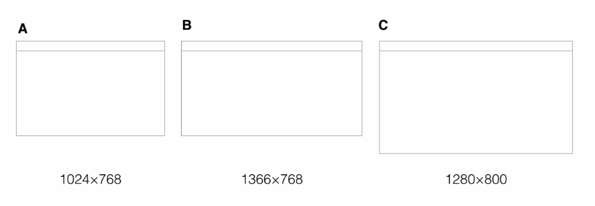

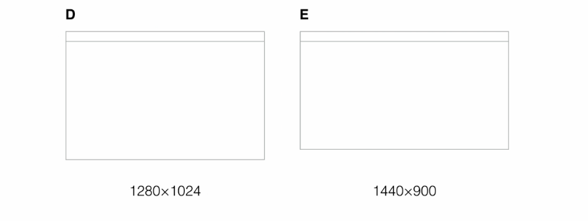

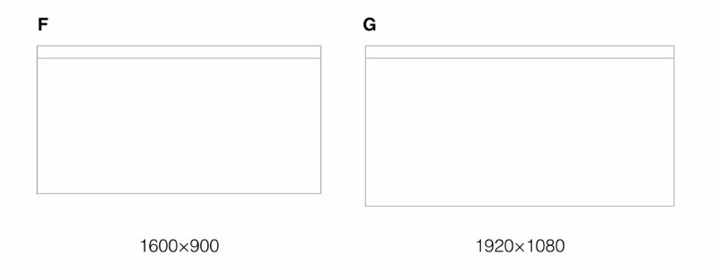

其实实际上没有那么大：网易、腾讯、知乎、淘宝的PC界面尺寸都是996px。

- [http://www.163.com/](http://www.163.com/)
- [http://www.qq.com/](http://www.qq.com/)
- [https://www.taobao.com/](https://www.taobao.com/)
- [https://www.zhihu.com/](https://www.zhihu.com/)

从上面几个主流的网站上可以看出国内的网页的设计宽度上限都设置为1000px，这是为了给用户更舒适的浏览体验。

## 主流浏览器

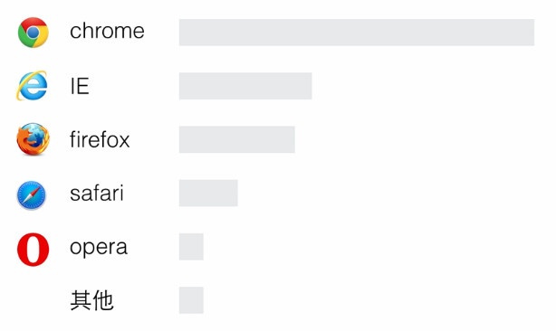

对于上面常见的浏览器，我们必须了解浏览器的设计特点（工具栏高度、信息的展示）才能帮助我们更好地设计页面。

## PC手势

### 点击

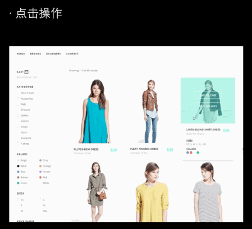

### 下拉

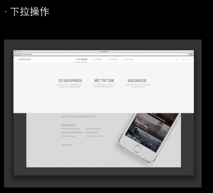

### 滚动

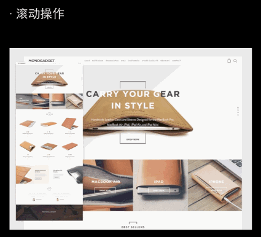

### Loading

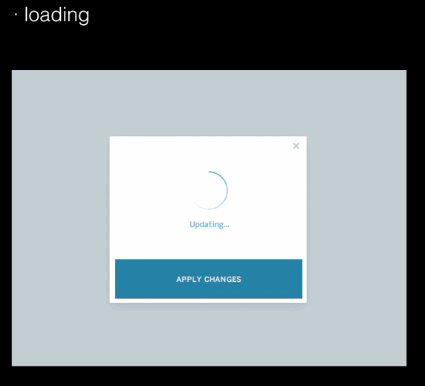

## HTML5页面

**HTML5页面**采用Html5语言写出的App，不需要下载安装。生存在浏览器中的应用，基本上可以说是触屏版的网页应用。

### 屏幕适配

屏幕分辨率太多，如何适配不同分辨率的屏幕？

—— 使用响应式设计。

- **响应式设计**指的是适应不同设备、屏幕、分辨率、操作方式（鼠标、键盘、触摸），保证信息在不同环境下表现一直，保证可交互可操作。

- **临界点**指的是页面结构发生变化的页面宽度。

- **栅格**指的是将页面分成几格、几块。栅格可以让页面信息更加简单完整，并且会更简单。

看看一个商品详情页面在不同设备上的设计表现：

**PC**

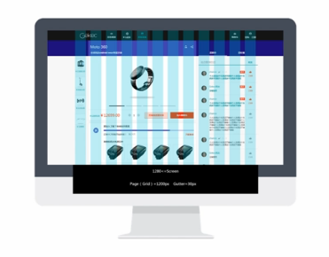

**平板横屏**

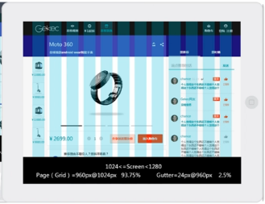

**平板竖屏**

**手机**

### 动效设计

H5页面要少用与系统本身有冲突的操作。

百度这个H5页面顶部banner的左右滑动动效与系统本身有冲突。

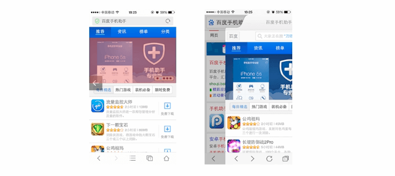

百度地图H5页面底部左右滑动查看不同线路的动效与系统本身有冲突

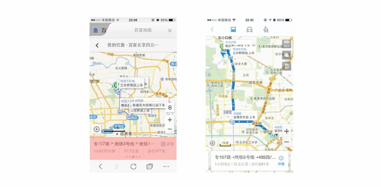

### 使用原生APP的UI控件

- 样式尽量与原生APP保持一致
- 文字字号、文字颜色可与app设计一致
- 减少不必要的手势操作
- 避免与浏览器的交互冲突，例如：左滑右滑操作。

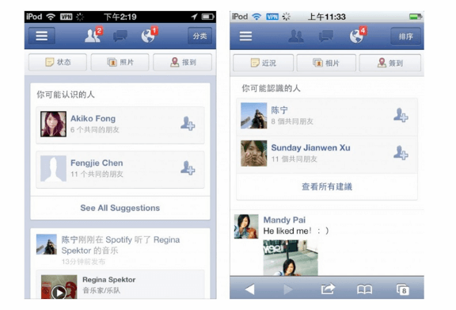

下面第三幅图的UI设计就与原生APP的UI控件有所不同

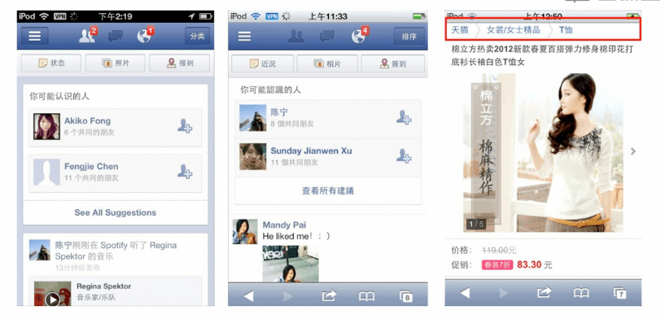

