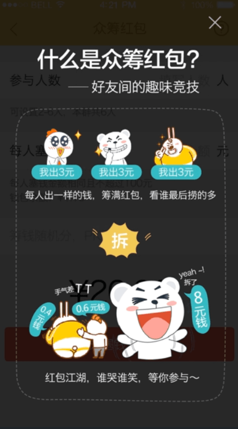

# 用户体验概述

用户体验指的是用户在使用产品或服务过程中建立起来的所有主观感受。用户体验可以从**有用性、易用性、满意度**三个方面来衡量。从心理学上来说，指的就是产品是否能符合用户的心智模型，这就要求我们在设计产品的时候要使其**操作符合现实生活中的经验规律**。

>心智模型：个体内心对世间各种事物的理解和解释，这些解释会沉淀为经验，用来对接触到的新事物进行**解释**和**预测**。

## 用户体验的三个要素

### 有用性

**有用性指的是产品能够满足用户的需求**，这里的需求可以分为：**基本型、期望型、兴奋型**，它们分别代表的是满足用户的基本需求、超出用户期望的需求、让用户兴奋的需求。在设计产品的时候需要在这三种不同的需求类型里做好适当的分配，从而达到让用户满意的状态。

### 易用性

**易用性主要指的是产品容易上手、操作方便**，这个是UI设计师在设计的时候需要重点考虑的问题。

### 满意度

**满意度指的是用户是否对产品满意**，其实这个是有用性和易用性效果的综合体现。

## 易信众筹红包案例

这是一个说明易信众筹红包怎么用的说明页面

**不好的设计**

它不好的地方有以下几点：

- 没有标题说明这个是什么东西，会加大用户的理解成本。
- 图1本想通过场景化的方式来使用户更加容易理解，但是使用方式不当，因为众筹红包并不是只能在你寂寞孤独的时候玩。
- 图2通过例子说明，但是却没有说每个人出2元之后会发生什么。
- 图3其实是想表达对于红包的理解，但是这个是说明众筹红包怎么用的，图3的信息属于无效信息。

总的来说，这个设计不好的地方在于其没有从头到尾完整地说明一个场景，并且向表达过多的信息。

**好的设计**

这个设计加上了大大的标题说明这个是什么东西，之后通过场景化的方式完整地说明了怎么玩众筹红包，以及结果是怎样的，简单明了。